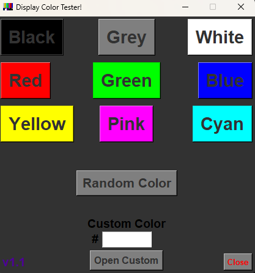
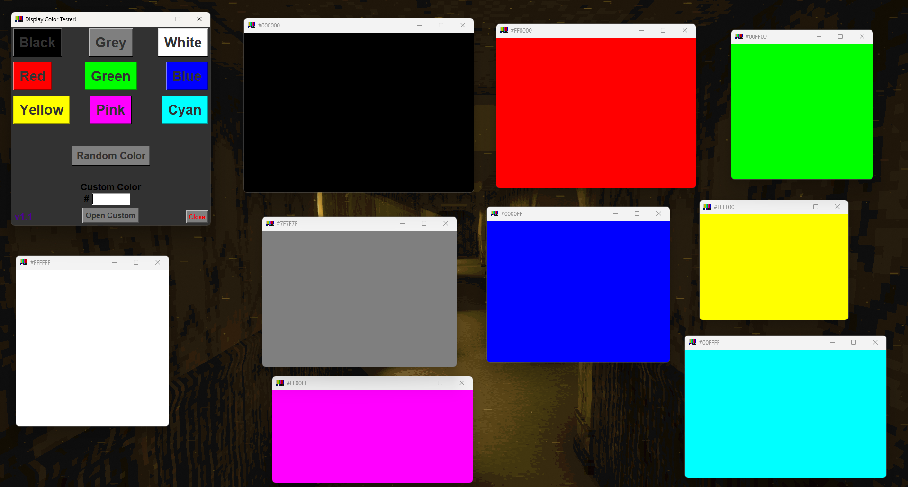
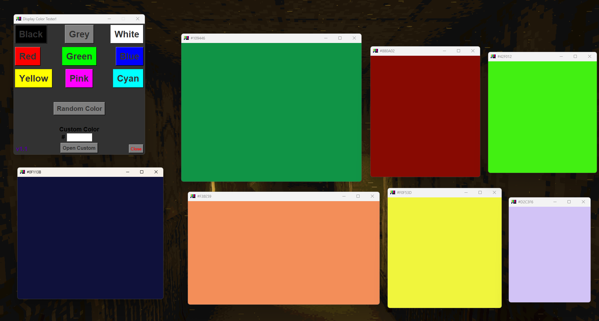
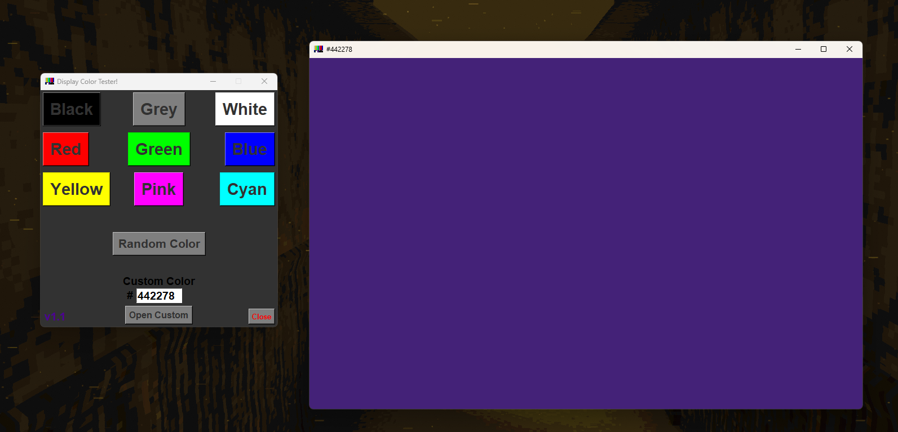

# | Display Color Tester!
'Display Color Tester' is a
very simple program written in
Python, which will allow the
user to choose a color
to display in it's own
resizable window!

## | General Purpose of Creation:
This tool aims to provide
the user a simple way
of troubleshooting possible display issues.
Or even simply checking how
colors look on a display!

This ability to quickly display
a chosen color on my
own monitors has personally helped
me troubleshoot and identify display
issues quite a few times,
as well as helped with
other display and color concerns.
This program's aim is to
hopefully provide that same helpful
experience to others!

### | A Few Use Cases:
- Using a plain white screen
to identify dust or dirt
on a display for easier
cleaning!

- Using a plain black screen
to identify and correct how
darker shades look on a
display!

- Using an RGB color to
identify dead pixels, or dead
sub-pixels in a display!

- Using a custom color to
preview how that color will
look on a display!

## | Previews:
The UI of this program
is very simple, utilizing the
native Python library, [***"tkinter"***](https://en.wikipedia.org/wiki/Tkinter)!

### | The Main Menu:

### | The Default RGB Colors:

### | The Random Color Option:

### | The Custom Color Option:

---

> [!NOTE]
> This program is by no
means meant to improve upon,
or be better than other
programs that hold the same
purpose or otherwise, provide the
same function! It is simply
a small project I've decided
to create and maintain for
fun! There are many alternatives
which do not require a
download, and are likely more
feature rich. Such as web
based options!
> ## | A Few Examples:
> - [***"Colour Test Screen"***](https://www.google.com/url?sa=t&rct=j&q=&esrc=s&source=web&cd=&cad=rja&uact=8&ved=2ahUKEwiK89X7tuKPAxUsJ0QIHccwMLEQFnoECCAQAQ&url=https%3A%2F%2Fwww.ledr.com%2Fcolours%2Fmulti.htm&usg=AOvVaw3x5-ypxllj9OhmxfWccYIZ&opi=89978449)
> - [***"Test My Screen"***](https://www.google.com/url?sa=t&rct=j&q=&esrc=s&source=web&cd=&cad=rja&uact=8&ved=2ahUKEwiK89X7tuKPAxUsJ0QIHccwMLEQFnoECBkQAQ&url=https%3A%2F%2Ftestmyscreen.com%2F&usg=AOvVaw1DO2ZbntndujLjrXWsFPZ3&opi=89978449)
> - [***"EIZO Monitor Test"***](https://www.google.com/url?sa=t&rct=j&q=&esrc=s&source=web&cd=&cad=rja&uact=8&ved=2ahUKEwiK89X7tuKPAxUsJ0QIHccwMLEQFnoECCEQAQ&url=https%3A%2F%2Fwww.eizo.be%2Fmonitor-test%2F&usg=AOvVaw16rOrGdhE8JgIxVfyaOGvT&opi=89978449)
> - [***"Mobile Screen Test"***](https://www.google.com/url?sa=t&rct=j&q=&esrc=s&source=web&cd=&ved=2ahUKEwiK89X7tuKPAxUsJ0QIHccwMLEQFnoECBYQAQ&url=https%3A%2F%2Fmobilescreentest.com%2F&usg=AOvVaw1j6_Zi2BGH7tQbco9pWyeS&opi=89978449)
> 
> ( *These are NOT created by me!* )